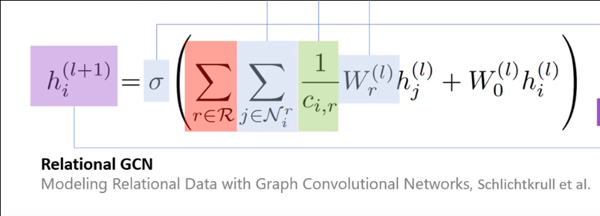

# Graph neural networks

## Graph NN

### Message passing

The features of one node can be embedded using the features of the connected nodes.

This can be done multiple times. This is a hyper-parameter.

The model goes from nodes X features to nodes X embedding size.

The size of the message passing is dependant on the task.

Close relations, or distant ones.

Too many passes lead to message smoothing.

The aggregation can be normalized by the degree of the node.

Binary masking for node level predictions:

    Train using nodes 1,2,4
    Predict nodes 3,5

How batches are handled with graphs in the DataLoader:

    A batch has multiple graphs of different size. Then a adjacency matrix is created combining all the graphs. This isn't a problem since the nodes from different graphs are disconnected

Edge features can be implemented to distinguish among different types of connections between nodes.

- Many convolution operations

## GAT

The aggregated features from each head are concatenated or averaged to obtain $ h_{1}^{'} $

## Graph attention resource

[Great explanation](https://www.youtube.com/watch?v=A-yKQamf2Fc)

[GitHub repo with example](https://github.com/gordicaleksa/pytorch-GAT)

## Python Library

- [Python Geometric](https://pytorch-geometric.readthedocs.io/en/latest/index.html)

- [GAT](https://pytorch-geometric.readthedocs.io/en/latest/modules/nn.html?highlight=attention#torch_geometric.nn.conv.GATConv)

## Results

### Link prediction

Paper

Metric      | MRR Filtered | Hits 1 | Hits 3 | Hits 10 |
-           | -            | -      | -      | -       |
FB15K-237   | .158         | .153   | .258   | .414    |
- DGL       | .155         | .089   | .128   | .228    |
-           | -            | -      | -      | -       |
FB15K       | .696         | .601   | .760   | .842    |
- DGL*      | .206         | .123   | .222   | .379    |
- DGL*(500) | .201         | .117   | .218   | .376    |
-           | -            | -      | -      | -       |
WN18        | .819         | .697   | .929   | .964    |
- DGL*      | .132         | .090   | .140   | .208    |

### Entity prediction

Datasets | AIFB  | MUTAG | BGS   | AM        |
-        | -     | -     | -     | -         |
Paper    | 95.83 | 73.23 | 83.10 | 89.29     |
DGL      | 93.32 | 73.53 | 86.21 | no_memory |

##

collate function
## Report

~20 pages
