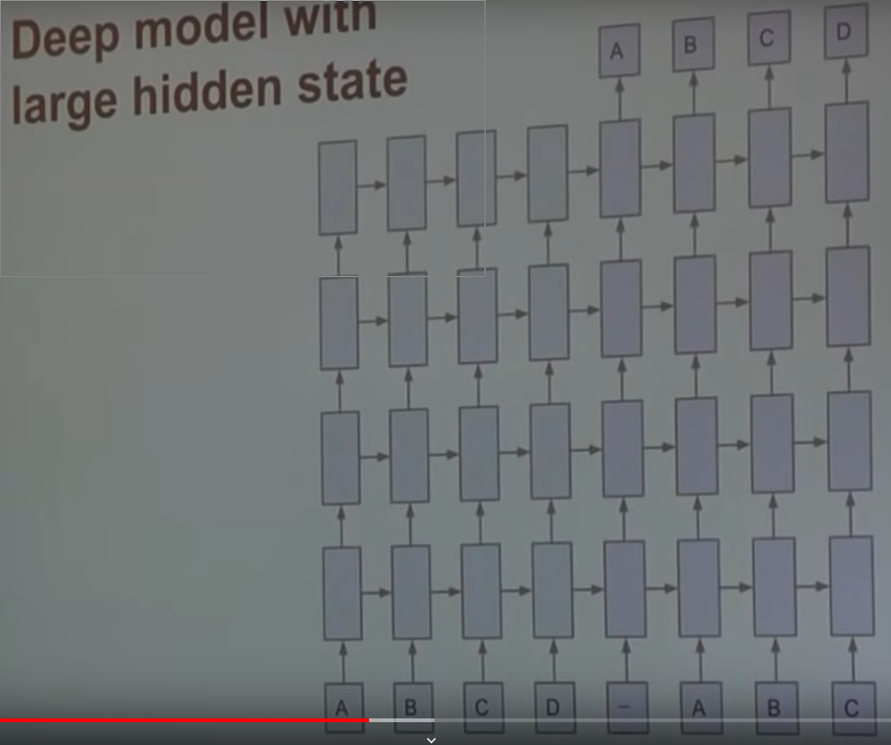

# BLEU Score (papinenni2001)

- Bilingual evaluation understudy
- Used for machine translation evaluation
- There are multiple correct translations for a sentence
- If it's pretty close to the given reference sentence, that were created by a human, it gets a High BLEU Score
- Not good for speech recognition
-

# Sequence to Sequence Learning with Neural Networks

## Motivation

- Machine Translation
- In input and the output don't have fixed lengths, therefore something like a DNN or a CNN, have issues.

## Architecture

- Encoder (RNN) that reads the input seq
- Decoder (RNN) that generates the output
- Beam Search decoding, takes the best N outputs, with the highest probabilities.

## Architecture (cont.)

## Model

- multi layer LSTM:
    - LSTM solve the issue of vanishing gradients;
- maps the input seq to a vector of fixed dimension
    - the hidden state of the last LSTM of the encoder acts as an embedding vector;
- reversing the word order of the inputs -> better performance.

## Implementation

Normalized Softmax

Get the most likely word

## Conclusion

The model does well on long sentence, but the higher the freq of rare words, the worse it performs.

## References
[paper presentation](https://www.youtube.com/watch?v=-uyXE7dY5H0)

# Presentation

# seq2seq

Basic Information

# BLEU score

Before continuing I would like to present a quick overview of the BLEU score.
How it works, and where it's being used.

# LSTM

Talk about the ls

# Results

The method was applied on the WMT'14 English to French machine translation.

- Translation without using a reference SMT
- Rescore the n-best list using a SMT as baseline

# Architecture

- deep LSTM 4 layers
- 1000cells at each layer
- 1000 dim word embedding
- 160,000 input vocab
- 80,000 output vocab

# Training

- 8-GPU machine ~ 6,3k words per minute
- 10 days training time

# Evaluation and results

- BLEU score
- great result on long sentences due to the reversal of inputs
- cannot handle <OOV> words

