## Disclaimer

Both papers are focused on machine translation, but they could be used for other tasks that deal with sequential data.

## BLEU Score [^3]

- Bilingual evaluation understudy.
- Used for machine translation evaluation.
- There are multiple correct translations for a sentence
- If it's pretty close to the given reference sentence, that were created by a human.
- The higher, the better.

[^3]: Kishore Papineni et. al., BLEU, 2001

## Sequence to sequence (2014)

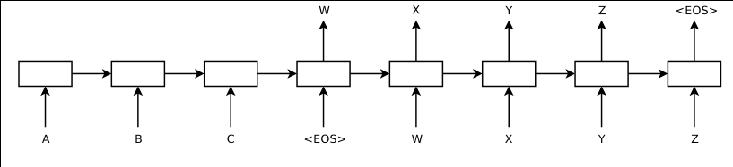

- Encoder (RNN) that reads the input seq
- Decoder (RNN) that generates the output
- Beam Search decoding, takes the best N outputs, with the highest probabilities.

## Architecture (cont.)

![Detailed Architecture[^2]](../notes/img/modeldetailedarchitecture.png){height=70%}

[^2]: (https://www.youtube.com/watch?v=-uyXE7dY5H0)

## Model

- multi layer LSTM:
    - LSTM solve the issue of vanishing gradients;
- maps the input seq to a vector of fixed dimension
    - the hidden state of the last LSTM of the encoder acts as an embedding vector;
- reversing the word order of the inputs -> better performance.

## Implementation

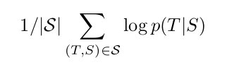{width=50%}

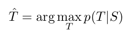{width=50%}

## Training

- Easy to train
- 160,000 Input Vocabulary
- 8 GPU machine
- 10 days of training
- WM14 English-French dataset
    - 36M sentence pairs

## Results

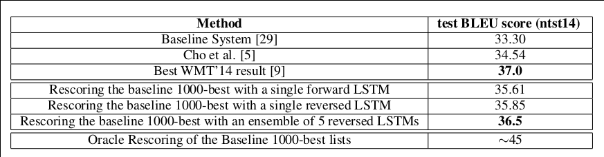

## Long sentences

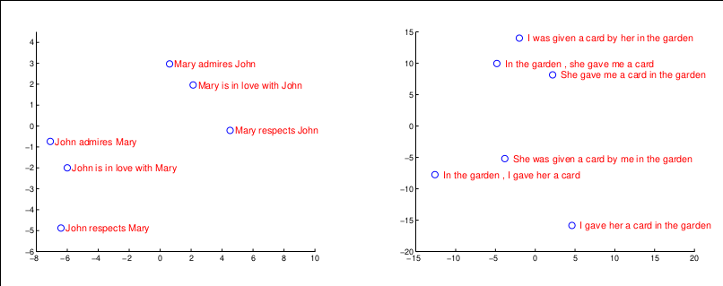

## Long sentences

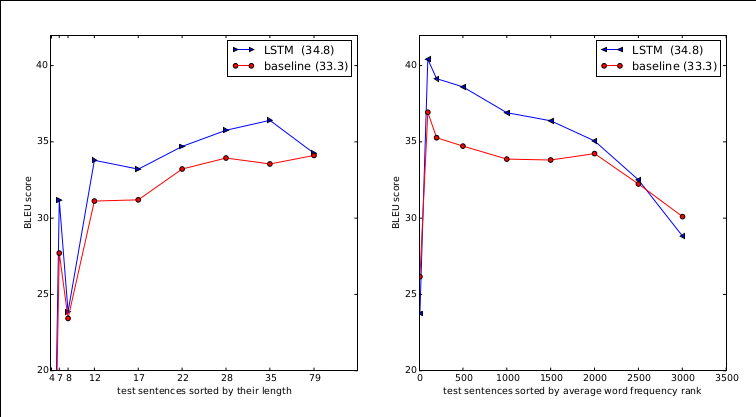

## Conclusion

- Simple approach to solve a complex problem.

- Better than the Statistical Models.

- The model does well on long sentence, but the higher the freq of rare words, the worse it performs.

## Attention and Transformers (2017)

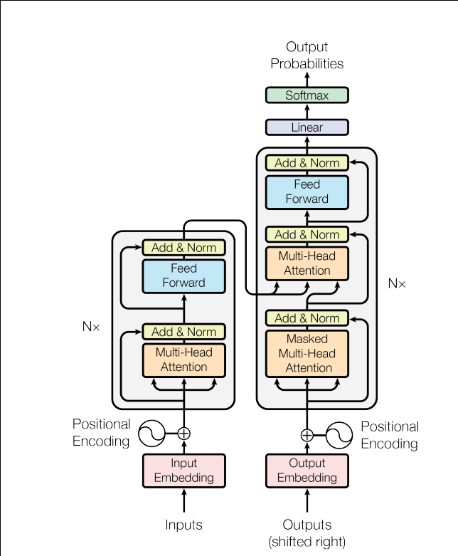{height=50%}

## Encoding Layer + Positional Encoding

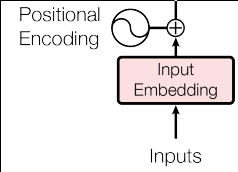{width=30%}

- Transform strings to numbers that the algorithm can read

- Because the whole sentence is fed to the network, the order of words is lost, therefore some of the meaning is lost.

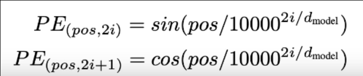{width=50%}

## Multi-Head attention layer

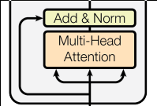{width=30%}

- Uses multiple attention layers;
- Attention: a vector for each word showing which word from sentence is relevant.

## Scaled Dot-product Attention

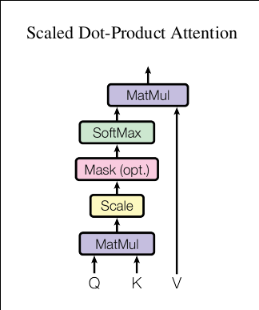{height=50%}

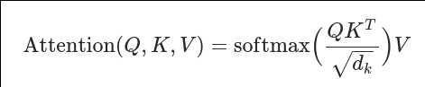{width=50%}

## Scaled Dot-product Attention

{width=50%}

- Q = the word that we want to calculate the attention for
- K = keys of the previously generated words
- V = values of the previously generated words
- $1/\sqrt(d_k)$ = scaling factor. If $d_k$ is large, the dot product has larger magnitude (Q * K).

## Multi-Head attention layer (overview)

- Multi head attention: used to reduce the attention on the same word.

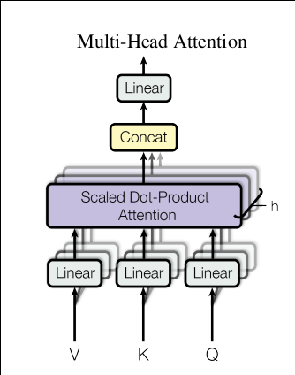{height=50%}

## Feed Forward network + Add & Norm

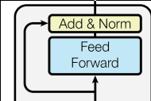{width=30%}

- FFN is applied to each attention vector, used for changing the shape of the attention vector.
- Layer normalization.

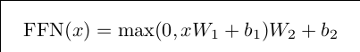{width=60%}

## Output embedding

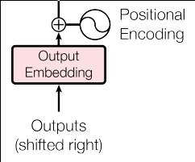{width=30%}

- Used for faster convergence, at training time.
- Same as input embedding. For MT, the embedding is done in the target language.

## Masked multi head attention

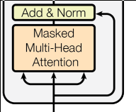{width=50%}

- So that the model doesn't "cheat", and look ahead in the future words, the words, that haven't been yet "seen" are masked out [^1]

[^1]:The attention of the 1st word is 1, the attention of the 2nd word is among the 1st and itself, the attention of the 3rd word is among the 1st, 2nd and itself etc.

## Encoder Decoder Attention ( the middle block in the Decoder )

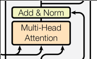{width=50%}

- Combines both languages, and also has the attention for each word.
- This is where the translation takes place

## Linear & Softmax

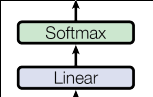{width=50%}

- Feed Forward Layer expands the dimension of the attention vector to the length of the target language vocabulary.
- Probability of the word, over the entire target language vocabulary.

## Training

- WMT14 English-German dataset
    - 4.5M sentence pairs
- WM14 English-French dataset
    - 36M sentence pairs
- The big models were trained for 3.5 days

- Diminishing Learning rate

$$lrate = d^{-0.5}_{model}\cdot(step\_num^{-0.5},step\_num \cdot warmup\_steps^{-1.5})$$

## Results

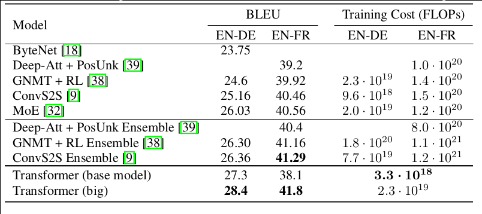

- EN-DE - SOTA 28.4 BLEU Score
- EN-FR - 41.0 High Score for low computational cost

## Advantages

- Faster than RNN or LSTM
- Faster to train than recurrent layer or convolution layers

